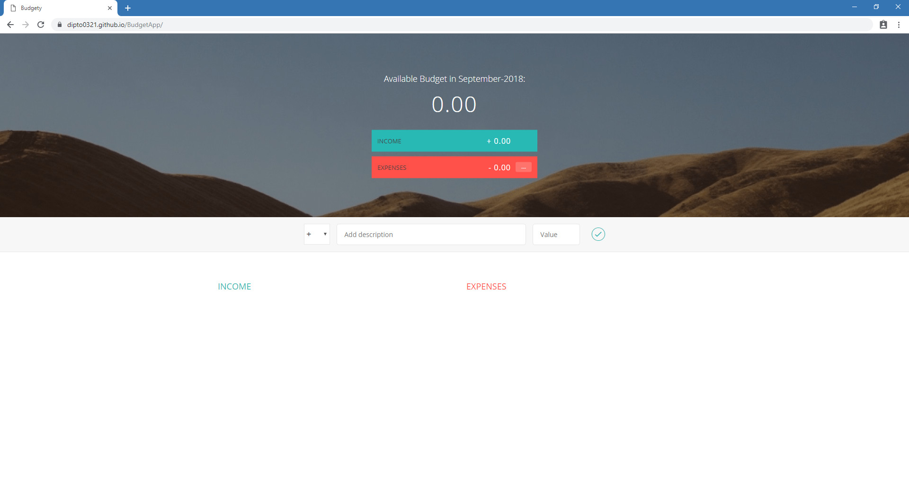
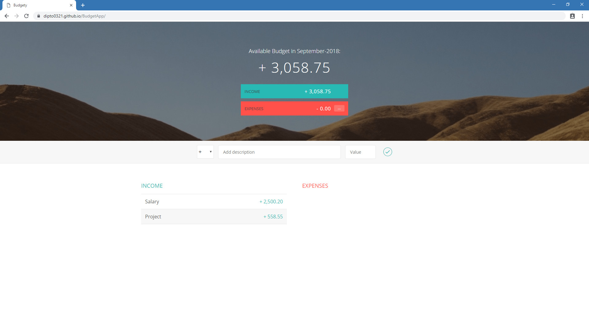
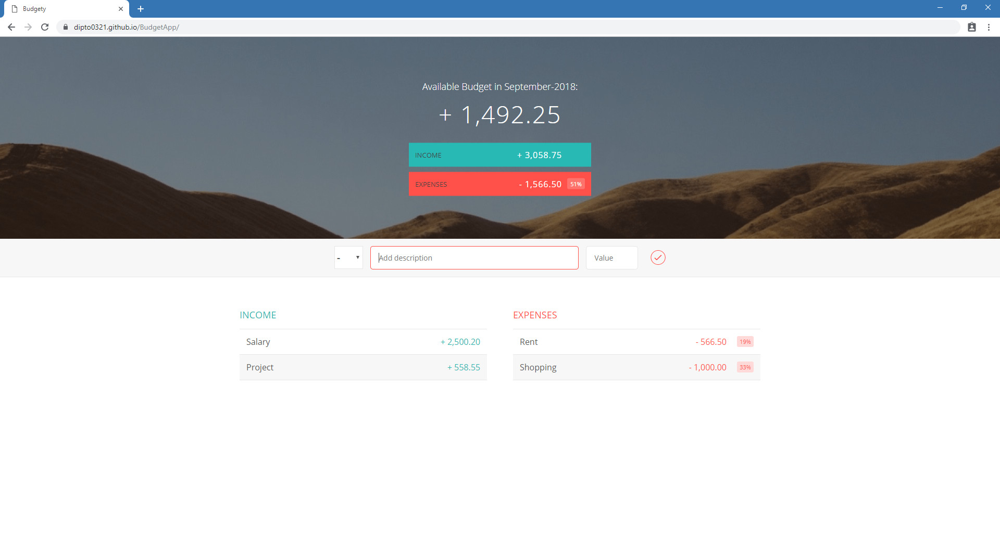
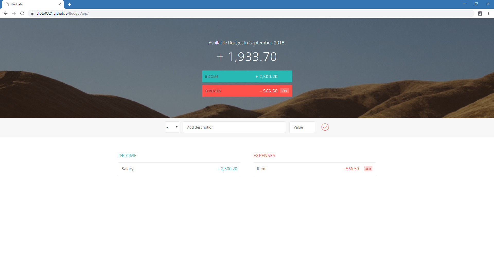

# BudgetApp

A web based budget calculating app using HTML5, CSS3 and Javascript. This is a learning based project done by following a course from [Udemy-The Complete JavaScript Course 2018: Build Real Projects!](https://www.udemy.com/the-complete-javascript-course/).

## [Live Demo](https://dipto0321.github.io/BudgetApp/)

### Screenshots

---

